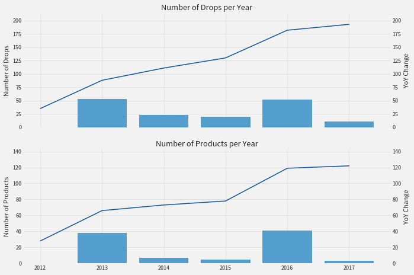
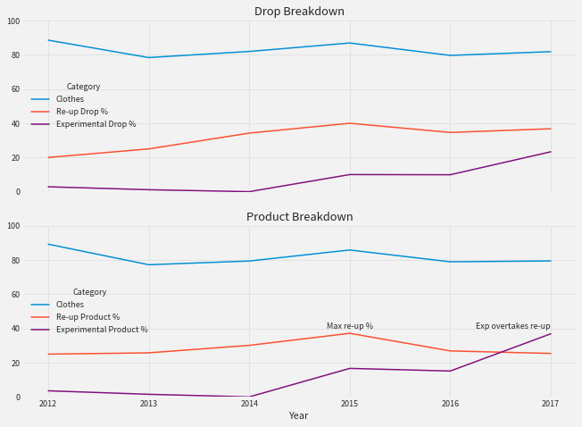
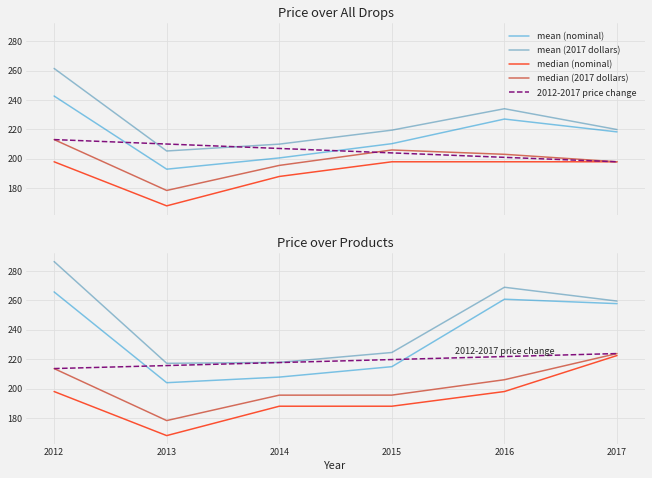
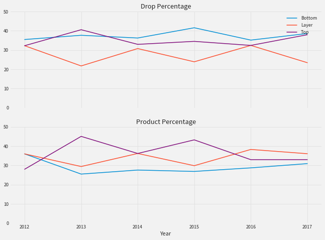
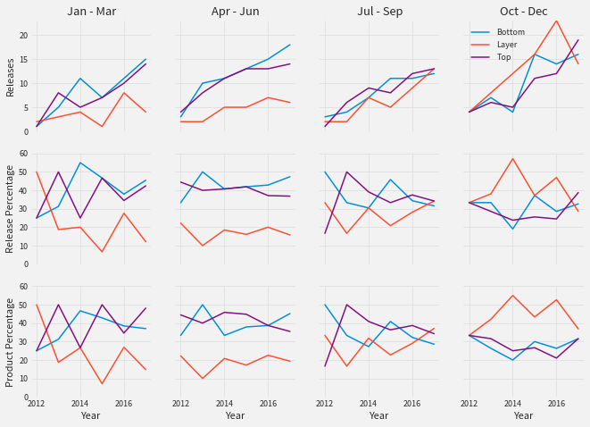
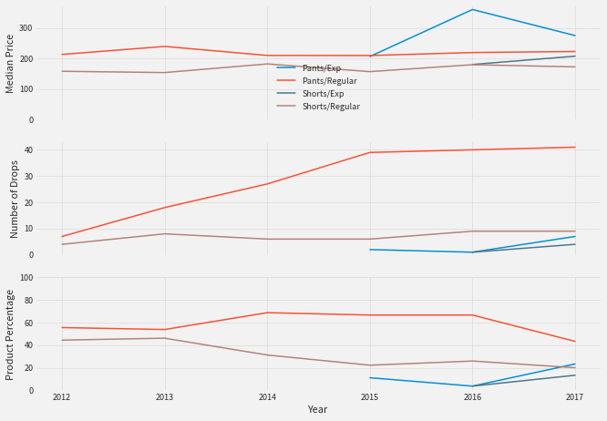
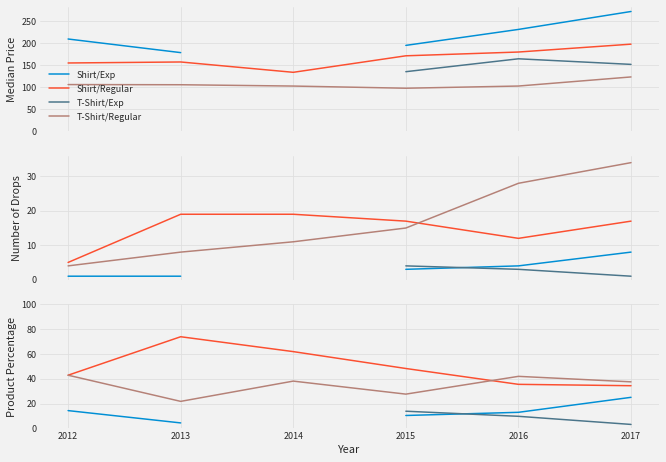
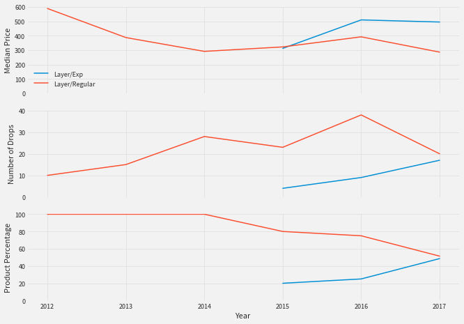

# Outlier 2017, The Year in Data

This started out as an answer a simple question: is Outlier getting more expensive or not?

Throughout 2017, comments repeatedly came up on the [Outlier subreddit](http://reddit.com/r/Outlier) complaining that this was happening and, furthermore, that the brand had shifted focus away from its core customer base to a new, more fashion-forward audience, resulting in a greater number of experimental drops with higher prices and neglect of its staple styles. I thought it would be interesting to take a closer look at the data and see if it was true.

But, as often happens, once I started exploring the data, the situation become more complex. There were different ways to look at the problem, there were a lot of ins, a lot of outs, a lot of what-have-yous... I began asking other questions, like does Outlier produce equal numbers of tops, bottoms, and layers? Has it always been this way? Is it different in different quarters? The result is this sprawling document.

# Drops and Products

Outlier has been growing. This is something that was obvious already in 2016, and was [confirmed by Abe](https://www.reddit.com/r/Outlier/comments/5mmsc2/is_outlier_growing/) at the beginning of 2017. This growth is visible in the number of drops and products per year, but in 2017, year-over-year change in the number of drops was basically stagnant. The big growth periods were 2013 and 2016.

Digging a little deeper to see how drops and products are distributed between clothes and items, between re-ups and experiments, we see that split between clothes and objects has been constant over the years, hovering at around 80% and not changing much in 2017, but there is a visible shift towards items explicitly labeled as experimental. Comparing to 2012 isn't entirely fair, since some pieces then were not designated as experimental but probably were thought of that way, but comparing to 2015 is.
In 2017, experimental drops made up over 20% of all drops and almost 40% of all products, considerably more than in 2015.

Also clear is the change in the percentage of *products* that get re-upped. The percentage of re-up drops is close to its peak in 2015, but in 2017 percentage of products that were re-upped was down noticeably and even overtaken by the percentage of experimental products.

# Prices

The optics of trends in the evolution of prices depends on how you make the comparison: with a suitable choice of time period, summary statistic, scope (all drops or all products), and inflation adjustment, you could plausibly make the case that Outlier has gotten cheaper, more expensive, or not changed dramatically in price.

For me, there are two time points that are especially salient. One is the year 2012, the first year for which the archive has solid data. At that time, Outlier was a small, but expanding, company putting out a mix of office staples and more experimental pieces, though not focused on keeping things in stock. Compared against that year, I would use inflation-adjusted 2017 dollars and argue that Outlier is very similar in price to what it was then: the median product is very slightly more expensive (in 2017 dollars), but the number of drops has increased 6-fold, so you are much more likely to be able to buy at least staples, and the median drop is slightly less expensive.

The other point of comparison would be 2015, which I think represents the most full development of the previous iteration of Outlier. It was the first year in which staples were reliably kept in stock; there were the occasional experimental OPP drops that year, but Outlier was largely focused on office-compatible clothing. Compared to 2015, Outlier has gotten somewhat more expensive: the median drop price hasn't changed, and the median product price has gone up, even in inflation-adjusted dollars.

## Regular vs. Experimental

Another way of looking at the evolution of prices is to consider the effect of the introduction of the experimental products line. As many have remarked, experimental products have a higher median price than regular products. Explicitly designated experiments were first introduced in 2015 as *Public Prototypes*. In that year, the median price for experiments was only slightly higher than the median price for all products. Since then, the median price for regular products has stayed basically the same, whereas the median price of experimental products was around $100 higher in 2017.

# Bottoms, Layers, Tops

## Category Percentages

Outlier's attention seems fairly evenly split between bottoms, layers, and tops. As a percentage of releases, bottoms have hovered around 40% of all drops and around 30% of all clothing products for the last 5 years. Tops have followed closely behind as a percentage of drops, and generally gotten more attention as a percentage of products. The last two years have seen layers taking the top slot in the percentage of products, followed by Tops, and then Bottoms, though the split is very close to even.

A more detailed picture arises if we look at the breakdown of drops per quarter.

Here we see where in the year particular categories are emphasized, and how the emphasis has been changing. Unsurprisingly, layers are dominant in the last quarter of the year. For the rest of the year, bottoms and tops generally make up a higher percentage of drops, tops a higher percentage of products, but the split is close to even.

## Category Details

Finally, we close by zooming in on the trends within individual categories. The following graphs show, for different classes of items within the categories, the following:
- The evolution of median prices (in 2017 Dollars)
- The numbers of drops
- The percentage of products in each class

### Bottoms

The price of regular items has been very consistent; the experimental items command a premium. The number of drops of regular products has also been consistent over the last few years, but the the product-percentage composition has changed as a result of the experimental lines.

### Tops

Tops exhibit quite a bit of fluctuation. The price of t-shirts has remained consistent, but the price regular shirts has been steadily increasing over the last few years, and experimental shirts are even more expensive than the regular ones.

T-Shirts have been dominating recently in terms of the number of drops, but those drops are drawn from a constant number of products.

### Layers

Regular layers have been declining in aggregate price. In 2017, layers were split 50/50 between regular products and experimental ones.

# Looking to 2018

Looking forward to see how these trends develop in 2018.
